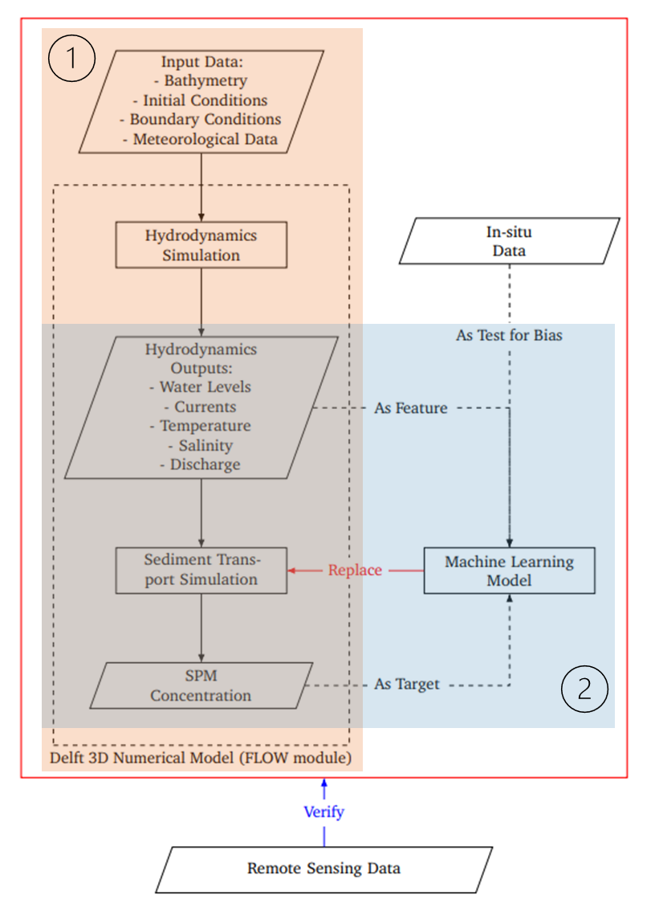

# MSc Thesis Diary
**Author**: Senyang Li,  **Affiliation**: University of Twente / Deltares

- [MSc Thesis Diary](#msc-thesis-diary)
- [1\_Mechanistic Model](#1_mechanistic-model)
  - [1.1 Overview](#11-overview)
  - [1.2 Hydrodynamics Simulation (FLOW module)](#12-hydrodynamics-simulation-flow-module)
  - [1.3 Sediment Transport Simulation  (WAQ module as a plug-in into FLOW module)](#13-sediment-transport-simulation--waq-module-as-a-plug-in-into-flow-module)
  - [1.4 Postprocessing](#14-postprocessing)
- [2\_Non-mechanistic Model](#2_non-mechanistic-model)
  - [2.1 Initial Machine Learning](#21-initial-machine-learning)
    - [2.1.1 Model Setting](#211-model-setting)
    - [2.1.2 Model Result](#212-model-result)
  - [2.2 Convolutional LSTM (ConvLSTM)](#22-convolutional-lstm-convlstm)
    - [2.2.1 Introduction](#221-introduction)
    - [2.2.2 Model Setting](#222-model-setting)
    - [2.1.3 Model result (On the construction, some published for reference)](#213-model-result-on-the-construction-some-published-for-reference)
    - [2.1.4 Issue](#214-issue)
- [X\_Ready to do](#x_ready-to-do)
- [Y\_Training History (Model-Differencing-Size)](#y_training-history-model-differencing-size)
  - [ConvLSTM - Differencing - (10,5,400,294)](#convlstm---differencing---105400294)
  - [ConvLSTM - Differencing -](#convlstm---differencing--)

<!-- <center>
    
    <br>
    <div style="color:orange; border-bottom: 1px solid #d9d9d9;
    display: inline-block;
    color: #999;
    padding: 2px;">Workflow Map</div>
</center> -->

<div>
  
</div>


# 1_Mechanistic Model

## 1.1 Overview

The study starts by running the Delft 3D model. Delft 3D is a comprehensive mechanistic modeling suite consisting of a series of modules for hydrodynamics, sediment transport, morphology and water quality in the fluvial, estuaries and coastal environments (Delft, 2011). The unit of the simulation is called flexible mesh, which is a curvilinear and boundary-fitted grid. The **FLOW module** is the core of Delft 3D and is a multi-dimensional hydrodynamic modeling system. The FLOW module **simulates the hydrodynamics** by modeling the unsteady flow and transport phenomena caused by tidal and meteorological forcing. The **WAQ module** models the water quality parameters and **sediment transport** as well from the hydrodynamic forcing. Sediment transport refers to the movement of particulates in the water. Water flow plays a vital role in this process, either by suspending particulates in the water column or pushing the particulates down to the bottom (Southard, 2006). The simulation here will **generate the SPM concentration** for the whole depth of the water. It can be a plug-in connected to the FLOW module and the two models can run as a whole.

The Delft 3D hydrodynamics and sediment model of the Dutch Wadden Sea (DWS) in 2017 has been already run and validated by (Zijl, Weerdenburg, and Laan (2023)). In theory, we could obtain the model output directly for the machine learning training. However, to save space, the original model skipped the output of most hydrodynamics parameters. Our study needs to **re-run the benchmark model to get the complete hydrodynamics parameters**. We will use its validated model settings and skip the unnecessary validation. **The model starts with the FLOW module to get all necessary hydrodynamics parameters first and continues with the WAQ plug-in to obtain the SPM**. Two years of data will apply: **2016 data are for model spin-off and 2017 data are used to get output**. There are in total 194000 grids, with resolution ranging from **200m (~1/8nm) to 0.5 nm (nautical mile).**


<div>
  
  
</div>

[Model Information](assets/11208054_006_0001.pdf)

## 1.2 Hydrodynamics Simulation (FLOW module)

The module was run on Deltares’ cluster with 20 nodes (4vcpu * 5 procedure). The bathymetry (geometry file, numerics file, physics file), initial condition (restart file), boundary condition (external forcing: DWSM-FM_200m.ext) and meteorological data (wind file) were used as input in the FLOW module.  All hydrodynamics outputs are as follows.

<details>

<summary>Hydrodynamics Output </summary>

    Wrimap_waterlevel_s0                = 1                                                                   # water levels for previous time step
    Wrimap_waterlevel_s1                = 1                                                                   # water levels
    Wrimap_waterdepth                   = 1                                                                  # water depths
    Wrimap_velocity_component_u0        = 1                                                                   # velocity component for previous time step
    Wrimap_velocity_component_u1        = 1                                                                   # velocity component
    Wrimap_velocity_vector              = 1                                                                   # cell-center velocity vectors
    Wrimap_velocity_magnitude           = 1                                                                  # cell-center velocity vector magnitude
    Wrimap_upward_velocity_component    = 1                                                                   # upward velocity component on cell interfaces
    Wrimap_density_rho                  = 1                                                                   # flow density
    Wrimap_horizontal_viscosity_viu     = 1                                                                   # horizontal viscosity
    Wrimap_horizontal_diffusivity_diu   = 1                                                                   # horizontal diffusivity
    Wrimap_flow_flux_q1                 = 1                                                                   # flow flux
    Wrimap_numlimdt                     = 1                                                                   # the number times a cell was Courant limiting
    Wrimap_taucurrent                   = 1                                                                   # the shear stress
    Wrimap_chezy                        = 1                                                                   # the chezy roughness
    Wrimap_salinity                     = 1                                                                   # salinity
    Wrimap_temperature                  = 1                                                                   # temperature
    Wrimap_turbulence                   = 1                                                                   # vicww, k and eps
    Wrimap_trachytopes                  = 1                                                                   # trachytope roughnesses
    Wrimap_wind                         = 1                                                                   # wind velocities
    Wrimap_windstress                   = 1                                                                   # wind stress
    Wrimap_heat_fluxes                  = 1                                                                   # heat fluxes
    Wrimap_DTcell                       = 1                                                                   # time step per cell based on CFL
    Wrimap_tidal_potential              = 1                                                                   # tidal potential
    Wrimap_internal_tides_dissipation   = 1                                                                   # internal tides dissipation 

</details> 

The hydrodynamics output can be categorized into 5 types: water level, currents, discharge, salinity and temperature. 

## 1.3 Sediment Transport Simulation  (WAQ module as a plug-in into FLOW module)

The hydrodynamics work as the input (hydrodynamic forcing) of WAQ module’s sediment transport simulation.  The SPM simulation needs quite a long time to spin up. In theory, we should run many years before 2016-01-01 to get a spun-up restart at that date, but typically those are not available. Here we take the second-best measure. We kept running (a multitude of) for 2 years (here, it is 2016 and 2017) and spinning up the model with hydrodynamic forcing until the model was in (dynamic) equilibrium. **In this case, we are assuming that the average of the hydrodynamic forcing during 2016-2017 is close to the one before 2016, which we don't have.** **These choices have already been made by the model developers, as model users we would stick to these choices. During such equilibrium, the SPM result of run n is very close to run n-1.  Once the equilibrium is achieved, the restart file (which records all conditions at a certain state) at the end of cycle n-1 will be used as the initial conditions for the final run of cycle n to have the final results. That is, the restart file of 2018-01-01 will be used as the initial conditions for the final run to get the result of 2016-01-01 to 2017-12-31.

## 1.4 Postprocessing

- **Temporal Selection:**  data in 2016 is regarded as the spin-up period and all daily data in 2017 were extracted, in total 365 from 2017-01-01 to 2017-12-31.

- **Layer Selection:** to synchronize with the remote sensing data afterward, only the first layer will be used.

- **Variable Selection:** The hydrodynamics outputs obtained have two structures: **[layer, variable, mesh2d_nfaces, time] (values differ by each flexible mesh)**; [layer, variable, mesh2d_nedges, time] (values differ by each edge of the mesh). The latter one is not very compatible with the input of machine learning. Besides, it contains similar variables to the first one. Therefore, we took the first structure. Around 20 hydrodynamics parameters would be utilized as targets. Further steps will be taken after the initial machine learning training and model explanation. For SPM, there are two partitions: IM1( inorganic matter 1) and IM2 (inorganic matter 2). We simply add them together to form the final SPM.
-   
    
     

> **Spatial Selection:**  as our study area is DWS, it makes senses to limit our  area of training to DWS. There are two ways of doing it: (1) To rasterize the whole image first and mask the output raster: the problem  is that if we rasterize it based on the default resolution, we would have a great loss of spatial information on the coastal area (200m zone) as the default resolution is at the middle of 200m to 0.5nm. But if we rasterize it with 200m’s resolution, there will be great waste of computation at 0.5nm zone. (2) To mask the original output first with `[burn_vector_geometry](https://deltares.github.io/xugrid/examples/vector_conversion.html)`  function of xugrid package and rasterize it with the resolution of 200m (as our study area is totally at 200m zone). For the initial training, we took the measure(1) and rasterized the whole image with the default resolution followed by masking.
> 
> 
> > **Rasterization**: The output we obtained are united as flexible meshes, which are irregular 2D grids. To extract the spatial information in the following machine learning,  the convolution needs to be applied. As common convolution  requires regular grid, we need to rasterize the output data into rasters. The structure will shift from [layer, variable, mesh2d_nfaces, time] to **** **[layer, variable, longitude, latitude, time].** The rasterization can be performed by dfmt.rasterize tools. Then the format of data is the more user-friendly x-array.
> > 

After above steps, the structure of the output becomes **[variable, longitude, latitude, time] ([20+1, 400, 294, 365]).** Thereinto, variable includes 20 hydrodynamics parameters and SPM , with the possibility to be simplified. Longitude and latitude is 400*294, which will be improved with better rasterization method. Time includes 365 values from 2017-01-01 to 2017-12-31. 

- One slice of SPM on 2017-04-01.
    
    
    

# 2_Non-mechanistic Model

## 2.1 Initial Machine Learning


To start the machine learning, **FCNN (Fully Connected Neural Network)** was applied. It  a basic neural network architecture where each neuron in a layer is connected to every neuron in the subsequent layer, forming a densely connected network.  FCNN enables the transformation of input data through successive layers of linear operations and non-linear activations, ultimately producing output relevant to the given task. We put **hydrodynamics** in the **input layer** and **SPM** in the **output layer**. The model was set up in **Keras** of Tensoflow. It is a high-level deep learning API written in Python, which provides a user-friendly interface for building, training, and deploying neural networks. It allows for seamless experimentation with various neural network architectures and facilitates rapid prototyping of machine learning models.

### 2.1.1 Model Setting

1. Take a sample space and time: 
    
    DWS + August 2017. As the neural network cannot deal with nan value, all nan values were replaced by 0.
    
2. Input layer (each neuron here stands for a 1D vector of one variable’s values): 
    
    this layer is meant for the feature (i.e., hydrodynamics). The data structure was flattened from **[variable, longitude, latitude, time] ([20, 400, 294, 31])** to  **[variable, longitude *latitude*time] ([20, 400*294*31]).** Training, validation and test dataset were set as 70%, 15%, 15%. All features went through the **normalization** to make sure they are comparable.
    
3. Output layer (each neuron here stands for a 1D vector of one variable’s values): 
    
    this layer is meant for the target(i.e., SPM). As we only have one variable, so one neuron was used here. The data structure was flattened from **[longitude, latitude, time] ([400, 294, 31])** to  **[ longitude *latitude*time] ([400*294*31]).** Training, validation and test dataset were set as 70%, 15%, 15%. The SPM value went through **logarithm** transformation to make its skew distribution normal.
    
4. Hidden layer:
    
    Different number of layers and neurons were testes and compared, including: **Tiny**[1 layer * 16neurons]; **Small**[2 layer * 16 neurons]; **Medium**[3 layer * 64 neurons]; **Large** [4 layers * 512 neurons]
    
5. Model optimizer: 
    
    **Learning rate** determines the step size of parameter updates during training in neural networks, playing a crucial role in balancing convergence speed and model stability. The "**InverseTimeDecay**" scheduler gradually reduces the learning rate over time, with the rate of reduction inversely proportional to the training step. This helps prevent overshooting of the optimal solution (going beyond the best convergence) and improves overall training performance.
    
    ```python
    lr_schedule = tf.keras.optimizers.schedules.InverseTimeDecay(0.001, decay_steps=STEPS_PER_EPOCH*1000,decay_rate=1,staircase=False)
    ```
    
6. Model evaluation:
    
    Since this is a regression issue, **MAE** (appointed as model loss), **MSE** and **R-Square** were used for model evaluation. The model loss curves for training and validation datasets were essential for the judgement of the model performance.
    

### 2.1.2 Model Result


Tiny model and Small model fit well, but with higher MAE. Medium model has lower MAE with a little overfitting. Large model has the lowest MAE, but the overfitting is very obvious.


Tiny


Small


Medium


Large

See above, the **medium** model [3layer*64 neurons] has the relatively the best performance. This model result provides the insight of the better structure of neural network that fits into the pattern of sediment process. It can also be used to compare the following types of models.

**SHAP (SHapley Additive exPlanations)** is a game theoretic approach with the ability to explain the output of any machine learning model (Lundberg and Lee, 2017). Grounded on the Shapley value in game theory, SHAP provides a fair and consistent way of credit allocation with local explanations. The contribution of each variables to the model prediction has been by predicted by SHAP, with the result as follows:


We can stratify them into 3 Tiers by natural breaks:

**Tier 1**:

Water Level (mesh_s1, mesh2d_s0)

**Tier 2**: 

Water quality Output  (1: Tau - *total bottom shear stress (N/m2)*, 2:TauFlow - *bottom shear stress by FLOW (N/m2),* 3: WaveHeight - *calculated height of a wind induced wave (m),* 4:WavePeriod - *calculated period of a wind induced wave (s)*, 5: WaveLength - *calculated length of a wind induced wave (m)*), Temperature

**Tier 3**:

Other variables

Based on those tiers, for the further training considering finer variable selection, there would be priority order from Tier 1 to Tier 3.

## 2.2 Convolutional LSTM (ConvLSTM)

### 2.2.1 Introduction

The initial machine learning  in essence didn’t differentiate the temporal and spatial aspect of dataset. **Convolutional LSTM  (ConvLSTM)** is a special neural network that combines **convolutional neural networks (CNN)** and **long short-term memory networks (LSTM)** to process **spatiotemporal data**. The motivation behind the ConvLSTM model is to overcome the limitations of traditional RNN and CNN by combining them. **ConvLSTM introduces convolutional operations in the spatial domain and recurrent operations in the temporal domain**, while preserving the memory units and gating mechanisms of LSTM, enabling it to capture features in both time and space, considering the long-term dependencies in sequential data and the local correlations in spatial structures.

> [LSTM](https://colah.github.io/posts/2015-08-Understanding-LSTMs/): LSTM (Long Short-Term Memory) is a type of recurrent neural network (RNN) architecture designed to capture long-term dependencies in sequential data by mitigating the vanishing gradient problem. It incorporates specialized memory cells and gating mechanisms to selectively retain and update information over time. LSTM expects input to have structure as [variable, value, time_step].
> 


A recurrent neural network (RNN) can be thought of as multiple copies of the same network, each passing a message to a successor.  In the above diagram, A refers to a chunk of neural network, xt is input and ht is output. Unfortunately, as that gap grows, RNNs become unable to learn to connect the information. 


LSTMs also have this chain like structure, but the repeating module has a different structure. Instead of having a single neural network layer, there are four, interacting in a very special way. They function as “gates” to forget unnecessary information, choose what new information needed to be stored in the cell state and decide what to output.


> [CNN](https://colah.github.io/posts/2014-07-Conv-Nets-Modular/): CNN (Convolutional Neural Network) is a deep learning architecture widely used for processing structured grid-like data such as images. It employs convolutional layers to automatically learn hierarchical patterns and features directly from the input data, enabling effective feature extraction and spatial hierarchies. It usually expects input structure as [batch_size, x, y, variable].
> 


> [ConvLSTM](https://zhuanlan.zhihu.com/p/675543830): In essence, ConvLSTM is a special LSTM. It follows the typical LSTM structure which focuses on predicting data on a timestep or a time series based on the input data of a time series. While, it adopts CNN's feature extraction approach in the spatial domain and replaces all fully connected structures in LSTM with convolutional structures. In that way, it enables the input data to have a spatialtemporal structure like **[batch_size, time_step, variables, x, y]**.
> 


### 2.2.2 Model Setting

The model was implemented in Keras and computed with GPU in Google Colab. (Each epoch 4min, 10 epoch for 40min)

1. Take a sample space and time: 
    
    DWS + 2017 all year. As the neural network cannot deal with nan value, all nan values were replaced by 0.
    
    `The resolution of the image will be improved later.`
    
2. Input : 
    
    this is meant for the feature (i.e., hydrodynamics). The data structure was **[batch_size, time_step, variables, longitude, latitude ]([10, 5, 20, 400, 294]).** `Batch_size is the total number of the timesteps that would be trained at one. We set it here as 10 to avoid reaching the limit of storage of GPU. Therefore, in total 365/10 = 36 batches were constructed. Temp_step is set as 5 to focus on predicting the SPM within a 5-day window. The spatial resolution and varibale would be finer afterwards.` Training, validation and test dataset were set as 70%, 15%, 15%. All features went through the **normalization** to make sure they are comparable.
    
3. Output: 
    
    this is meant for the target SPM. The data structure was **[batch_size, time_step, longitude, latitude ]([10, 5, 400, 294]).** `Batch_size is the total number of the timesteps that would be trained at one. We set it here as 10 to avoid reaching the limit of storage of GPU. Therefore, in total 365/10 = 36 batches were constructed. Temp_step is set as 5 to focus on predicting the SPM within a 5-day window. The spatial resolution would be finer afterwards.` Training, validation and test dataset were set as 70%, 15%, 15%. The SPM value went through **logarithm** transformation to make its skew distribution normal.
    
4. Hidden Layer:
    
    Test 1: Reflection layers (size preservation) → ConvLSTM layer (kernel size: 3)→ Reflection layers (size preservation) → ConvLSTM layer  (kernel size: 5)→ Reflection layers (size preservation) → ConvLSTM layer (kernel size: 5) → ReLU function (-1, ∞)  (error minimization)
    
5. Model optimizer: 
    
    **Learning rate** was set as 0.001. `The "**InverseTimeDecay**" scheduler was on the to-do list.`
    
6. Model evaluation:
    
    Since this is a regression issue, **MAE** (appointed as model loss), **MSE** and **R-Square** were used for model evaluation. The model loss curves for training and validation datasets were essential for the judgement of the model performance.
    

### 2.1.3 Model result (On the construction, some published for reference)


Predict image on Day 1 at selected day


True image on Day 1 at selected day


### 2.1.4 Issue

1. Differencing: 差分本质上就是在预测变化值，问题在于变化值很小，MAE不能跟非差分比较，但还原会原值MAE又受到了巨大的原值影响
    1. **Original: [batch_size, time_step, longitude, latitude ]([10, 5, 400, 294]) :**
        1. No additional processing → Original MAE
            1. showcase (图+MAE)
        2. 
    2. **After differencing: [batch_size, time_step (differencing), longitude, latitude ]([10, 5-1, 400, 294])**
        1. Differencing → Much lower value than original → Much lower MAE (how to compare?) → Back to original (add true)→ Dominated by true value
            1. showcase(图 MAE→ 复原图 MAE)
        2. WHY Differencing → Stationary → LSTM (non-linear) which could handle
            1. Analysing differencing: not like keeping original data → more like keeping the daily changes → like predicting the changes instead of original

# X_Ready to do

1. ~~Initial Machine Learning → Benchmark;~~ 
2. ConvLSTM 
    1. ~~Complete the evaluation: [MAE,MSE loss] [R-Square loss] [5 days forecast loss] [image comparison]~~ 
    2. Tune the model: (model structure: layer number, parameter of layer) (learning rate) (other hyperparameter) 
    3. Improve the model: (spatial resolution) (area expansion) (time_step number/batch_size) (variable selection)
3. Benchmark model about SPM prediction
4. Other types [spatio-temporal models](https://www.mdpi.com/2072-4292/15/18/4486) 

# Y_Training History (Model-Differencing-Size)

文件编号：Dif<R>/Ori-10-5-S/M/L-Tahn/Linear/Relu/Sig-其他

差分<差分复原>/本真-batch size-空间-激活层-其他

Output 1: Curve_Loss

Output 2: MSE/MAE/RMSE in following days

Output 3: Maps of random days

第二部:

a.DIF预测第一个变化→每日变化→根据第一个SPM值来预测 (→ 间隔SPM预测)

b.预测ORI

第三部

a.DIF预测多个变化→多个预测值→共同作用 ( 最后获得每日变化,第二部a第二步)

问题:SPM/SPM-diff都归一化到-1,1 就可以比较了

## ConvLSTM - Differencing - (10,5,400,294)

## ConvLSTM - Differencing -